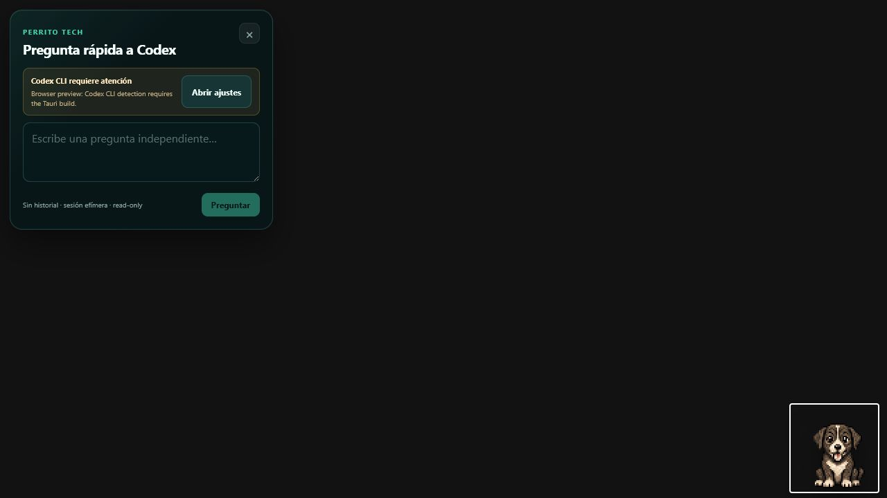

<p align="center">
  
</p>

<h1 align="center">OpenFamiliar</h1>

<p align="center">
  <strong>A Windows pixel-art desktop companion with one-shot Codex CLI questions.</strong>
</p>

<p align="center">
  <a href="https://github.com/georgiegozz/openfamiliar/actions/workflows/ci.yml"></a>
  
  
  
</p>

Perrito Tech lives in a transparent always-on-top window. Click the mascot, ask
one independent question, receive the answer from an existing authenticated
Codex CLI installation, and discard the interaction. There is no conversation
history, workspace context, memory, autonomous execution, or API-key storage.

> OpenFamiliar is an independent open-source project and is not affiliated with,
> sponsored by, or endorsed by OpenAI or any other tool vendor.



## Public beta candidate v0.1

| Capability                                          | Status                                           |
| --------------------------------------------------- | ------------------------------------------------ |
| Windows 11 x64 Tauri desktop                        | Implemented; local automated validation          |
| Perrito Tech 64×64 frames at 128 px default         | Implemented; original CC BY 4.0 art              |
| Static idle and event-only animation                | Implemented; no random movement or eye tracking  |
| Teal, midnight, and burgundy prop-accent palettes   | Implemented; deterministic generated variants    |
| Transparent mascot and separate Settings window     | Implemented                                      |
| One-shot Quick Ask through Codex CLI                | Implemented with fake-CLI tests                  |
| Timeout, cancellation, process-tree cleanup         | Implemented with fake-CLI tests                  |
| System tray and click-through recovery              | Implemented                                      |
| Non-sensitive preferences and monitor-safe position | Implemented with unit tests                      |
| MSI and NSIS installers                             | Build configured; see release validation results |
| Clean-user Windows smoke test                       | Operator step; not implied by compilation        |

The beta runtime is local-first and idle-offline. It does not read Codex auth
storage; it invokes the official CLI already installed and authenticated by the
operator. Questions and answers remain in memory only. Operational logs contain
event categories, not content.

## Download

No official binary has been released yet. The first `v0.1.0` beta installer will
be published only through [GitHub Releases](https://github.com/georgiegozz/openfamiliar/releases)
after the clean-user Windows smoke test passes. Do not download OpenFamiliar
binaries from third-party sites.

The initial beta will be unsigned, so Windows may display a SmartScreen warning.
Each release will include `SHA256SUMS.txt`; public-repository builds also generate
GitHub artifact attestations. Verify a downloaded installer with:

```powershell
Get-FileHash .\OpenFamiliar_*.exe -Algorithm SHA256
gh attestation verify .\OpenFamiliar_*.exe --repo georgiegozz/openfamiliar
```

Unsigned does not mean unverified: compare the SHA-256 value with the release
checksum and install only when both the repository and artifact are trusted.

## Experimental / Future

The monorepo retains scaffolds for other providers, workspaces, permissioned
agents, MCP, Creator Studio, VS Code integration, advanced packs, and shared core
services. They are not initialized or visible in the stable Windows MVP and must
not be described as finished product capabilities. See [ROADMAP.md](./ROADMAP.md).

## Repository Layout

```text
apps/desktop/              stable Windows Tauri + React application
packages/mascot-runtime/   pixel-art animation runtime
packages/mascot-sdk/       familiar pack types
packages/provider-sdk/     one-shot provider contract + experimental contract
mascots/perrito-tech/      canonical spritesheet, manifest, and art license
crates/                    experimental/future shared Rust services
adapters/                  experimental/future provider and CLI scaffolds
docs/                      ADRs, playbooks, security, testing, and guides
.agents/skills/            repo-local Codex skills
```

## Prerequisites

- Windows 11 x64
- Node.js 20+
- pnpm 9.15.0 (declared by `packageManager`)
- Rust stable with `rustfmt` and `clippy`
- Python 3.12 for deterministic mascot asset checks
- Visual Studio Build Tools 2022: Desktop development with C++
- WebView2 Runtime
- Codex CLI installed and authenticated for real Quick Ask use

## Develop

```powershell
# Run from the repository root.
corepack enable
corepack prepare pnpm@9.15.0 --activate
pnpm install --frozen-lockfile
py -3.12 -m venv .venv
.\.venv\Scripts\python.exe -m pip install -r .\scripts\assets\requirements.txt
pnpm --filter @openfamiliar/desktop tauri dev
```

Browser-only UI preview uses a non-network mock and cannot invoke Codex:

```powershell
pnpm --filter @openfamiliar/desktop dev
```

## Validate

Automated tests never call the real Codex service or consume quota.

```powershell
pnpm format:check
pnpm typecheck
pnpm test
pnpm build
pnpm assets:check
cargo fmt --all -- --check
cargo clippy --workspace --all-targets -- -D warnings
cargo test --workspace
pnpm validate:packs
pnpm licenses:audit
```

## Build Windows Installers

```powershell
pnpm --filter @openfamiliar/desktop tauri build
```

Unsigned MSI and NSIS artifacts are produced below `target/release/bundle/`.
The source is suitable for a pre-1.0 public beta after the checks above pass.
Binary release claims remain blocked on code signing and the clean-user test; a
successful local build is not a substitute for the checklist in
[WINDOWS_MVP_SMOKE_TEST.md](./docs/testing/WINDOWS_MVP_SMOKE_TEST.md).

## Security and Privacy

- No generic shell command or user-supplied CLI arguments.
- Fresh ephemeral, read-only Codex process per question.
- Prompt input and output size limits, timeout, cancellation, and process-tree kill.
- Restrictive Tauri CSP and minimum capability allowlist.
- No auth/session scraping, `.env` runtime loading, loopback listener, MCP, or remote UI.
- No prompt, answer, credential, token, or raw process output in logs.

See [ADR-009](./docs/adr/ADR-009-windows-one-shot-mvp.md) and the
[security boundary playbook](./docs/agent-playbooks/security-boundaries.md).

## License

- Code: [Apache License 2.0](./LICENSE)
- Perrito Tech artwork: CC BY 4.0
- Blank templates: CC0-1.0

See [NOTICE](./NOTICE), [THIRD_PARTY_NOTICES.md](./THIRD_PARTY_NOTICES.md), and
the Perrito Tech [asset notice](./mascots/perrito-tech/NOTICE).
